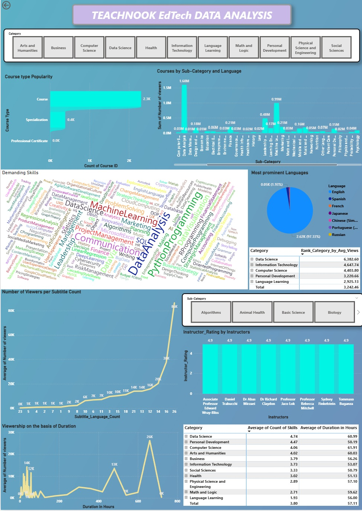

# Teachnook-EdTech-Data-Analysis

**Business Intelligence and Data Analysis for Teachnook EdTech Company**
### Sales Performance Dashboard

This repository contains the data analysis, business intelligence dashboards, and strategic insights developed for Teachnook. The project focuses on tracking Key Performance Indicators (KPIs), analyzing user behavior, optimizing sales pipelines, and guiding content strategy to drive measurable business growth.

> **🏆 Business Impact:** Delivered **+12% sales growth**, achieved a **9.53% conversion rate**, and generated **₹2,47,500 in revenue** through insight-driven execution, pipeline optimization, and strategic partnerships with sales and marketing teams.

---

## 📊 Project Scope & Deliverables

### 1. Spreadsheet-Based Analytics & Automation
* **Dataset Construction:** Built robust datasets using Google Sheets and Microsoft Excel for tracking core business metrics.
* **KPI Tracking & Funnel Analysis:** Developed dashboards for segmentation, funnel analysis, and automated reporting.
* **Behavioral Analysis:** Evaluated user behavior, acquisition channels, and email marketing performance.
* **Trend Identification:** Pinpointed peak activity windows, regional user patterns, and emerging growth trends.

### 2. Power BI Dashboards & Data Modeling
* **Data Preparation:** Performed rigorous data cleaning, transformation, and DAX modeling to structure raw data for analysis.
* **Interactive Visualizations:** Designed dynamic KPI visuals and custom slicers for intuitive data exploration.
* **Content & Engagement Assessment:** Analyzed course views, student ratings, watch duration, and instructor performance.
* **Strategic Insights:** Generated actionable insights to inform future content strategies and overarching growth decisions.

---

## 🛠️ Tech Stack

* **Power BI:** Data modeling, DAX, and interactive dashboard creation.
* **Google Sheets / Microsoft Excel:** Data storage, initial cleaning, funnel analysis, and automated KPI tracking.
* **Microsoft Word:** Documentation and reporting.

---

## 💡 Key Insights & Strategy

* **Sales & Marketing Alignment:** Partnered directly with sales and marketing teams to enhance campaign targeting, improve ROI, and boost overall conversion performance.
* **Content Optimization:** Leveraged instructor ratings and engagement durations to determine which course types drive the highest retention and satisfaction.
* **Pipeline Optimization:** Streamlined the user acquisition funnel to reduce drop-offs and accelerate the path to purchase.

---

## 📂 Repository Structure

*(Note: Adjust these folders based on your actual repository contents)*
* `/Data/` - Anonymized raw datasets and cleaned data files.
* `/Dashboards/` - Power BI `.pbix` files and exported PDF/PNG versions of the dashboards.
* `/Reports/` - Executive summaries and detailed documentation (MS Word/PDF).

## 🚀 How to View
**Interactive Dashboard:** 🌐 [Click here to view the live Teachnook dashboard](https://app.powerbi.com/view?r=eyJrIjoiMzEwMTBiYzAtNjUyNi00ZWZlLThiMTMtODA0YzVjZmZlNjc0IiwidCI6Ijg5OWM1ZDljLTVmMjUtNDFmZS05YWVjLTdjYWI1MGY4YTQ4ZiJ9)
1. Clone the repository: `git clone https://github.com/yourusername/Teachnook-EdTech-Data-Analysis.git`
2. Open the `/Dashboards/` folder to view the Power BI file. Note: You must have [Power BI Desktop](https://powerbi.microsoft.com/desktop/) installed to interact with the `.pbix` file.
3. Review the executive summary in the `/Reports/` folder for a detailed breakdown of the business insights.
